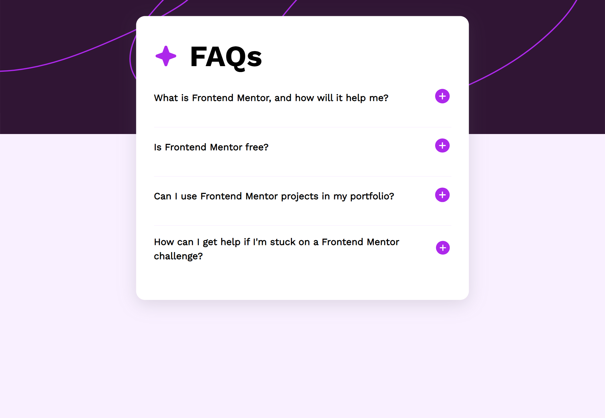

# Frontend Mentor - FAQ accordion solution

This is a solution to the [FAQ accordion challenge on Frontend Mentor](https://www.frontendmentor.io/challenges/faq-accordion-wyfFdeBwBz). Frontend Mentor challenges help you improve your coding skills by building realistic projects.

## Table of contents

- [Overview](#overview)
  - [The challenge](#the-challenge)
  - [Screenshot](#screenshot)
  - [Links](#links)
- [My process](#my-process)
  - [Built with](#built-with)
  - [What I learned](#what-i-learned)
  - [Continued development](#continued-development)
  - [Useful resources](#useful-resources)
- [Author](#author)

**Note: Delete this note and update the table of contents based on what sections you keep.**

## Overview

### The challenge

Users should be able to:

- Hide/Show the answer to a question when the question is clicked
- Navigate the questions and hide/show answers using keyboard navigation alone
- View the optimal layout for the interface depending on their device's screen size
- See hover and focus states for all interactive elements on the page

### Screenshot



### Links

- Solution URL: [GitHub Code Link](https://github.com/AmanGupta1703/FAQ-accordion-FEM)
- Live Site URL: [Vercel App Preview](https://faq-accordion-fem-chi.vercel.app/)

## My process

### Built with

- Semantic HTML5 markup
- CSS custom properties
- Flexbox
- CSS Grid

### What I learned

```html
<div class="card card--accordion" data-qId="${item?.id}">
	<div class="card__header">
		<h2 class="card__question">${item?.question}</h2>
		<div class="button-container">
			<button class="btn btn--hide">
				
			</button>
			<button class="btn btn--show">
				
			</button>
		</div>
	</div>
	<div class="card__body card__body--hide">
		<p class="card__answer">${item?.answer}</p>
	</div>
</div>
```

```css
.card {
	margin-top: 1.5rem;
}
.card:not(:last-child) {
	border-bottom: 0.1rem solid var(--color-light-pink);
}
.card__header {
	cursor: pointer;
	display: -webkit-box;
	display: -ms-flexbox;
	display: flex;
	-webkit-box-align: center;
	-ms-flex-align: center;
	align-items: center;
	-webkit-box-pack: justify;
	-ms-flex-pack: justify;
	justify-content: space-between;
}
.card__question {
	font-size: 1.6rem;
}
.card__question:hover {
	color: #ad28eb;
}
.card__body {
	margin-top: 1.6rem;
	padding-bottom: 1.6rem;
	-webkit-transition: 0.5s all;
	transition: 0.5s all;
}
.card__body--hide {
	height: 0;
	overflow: hidden;
	visibility: hidden;
	opacity: 0;
}
.card__body--show {
	height: auto;
	overflow: auto;
	visibility: visible;
	opacity: 1;
}
.card__answer {
	font-size: 1.4rem;
	opacity: 0.5;
}

.btn {
	cursor: pointer;
}
.btn--hide {
	display: none;
}
.btn--show {
	display: inline-block;
}
```

```js
import { accordionFAQData } from "./data.js";
import { renderAccordionCard, toggleButton } from "./helper.js";

function init() {
	const accordionListEl = document.querySelector(".accordion-list");
	renderAccordionCard(accordionListEl, accordionFAQData);

	handleAccordionClick();
}

function handleAccordionClick() {
	const cardsEl = document.querySelectorAll(".card");

	let prevSelectedQuestion;

	cardsEl.forEach((cardEl) => {
		cardEl.addEventListener("click", (e) => {
			const cardEl = e.target.closest(".card");
			const cardBodyEl = cardEl.querySelector(".card__body");
			const btnsEl = cardEl.querySelectorAll(".btn");

			const { qid } = cardEl.dataset;

			document.querySelectorAll(".card__body").forEach((cardBodyEl) => {
				cardBodyEl.classList.add("card__body--hide");
				cardBodyEl.classList.remove("card__body--show");
			});

			if (prevSelectedQuestion === Number(qid)) {
				cardEl.querySelector(".card__body").classList.add("card__body--hide");
				cardEl
					.querySelector(".card__body")
					.classList.remove("card__body--show");

				toggleButton(btnsEl);
				prevSelectedQuestion = null;
				return;
			}
			// show answer
			cardBodyEl.classList.remove("card__body--hide");
			cardBodyEl.classList.add("card__body--show");

			// button
			toggleButton(btnsEl);

			prevSelectedQuestion = Number(qid);
		});
	});
}

init();
```

### Continued development

- **Responsive Design**
- **Code Modularity**
- **Documentation**
- **Animation and Transition Effects**

### Useful resources

- [closest() method](https://developer.mozilla.org/en-US/docs/Web/API/Element/closest)

## Author

- Website - [Kunal S. Gupta](https://www.your-site.com)
- Frontend Mentor - [@AmanGupta1703](https://www.frontendmentor.io/profile/AmanGupta1703)
- Twitter - [@thekunalgupta17](https://www.twitter.com/thekunalgupta17)
